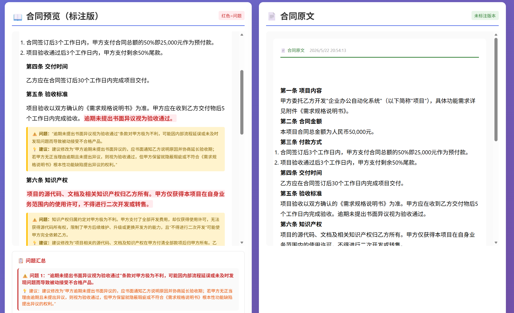
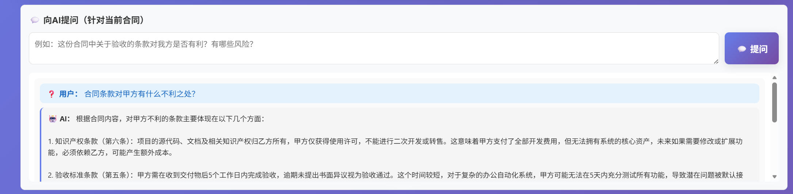

<div align="center">

# 📜 AI合同审核工具 | Contract Review Assistant

**上传 DOCX · AI智能审核 · 保留格式导出 · 自由问答 · 原文在线编辑**

[](https://github.com/hexiongjiu/contract-reviewer/actions/workflows/pages.yml)
[](LICENSE)
[](https://hexiongjiu.github.io/contract-reviewer/)

</div>

---

## 📸 界面预览

| 工具首页 | 原文对照 |
|:---:|:---:|
|  |  |

| 向AI提问 |
|:---:|
|  |

---

## 🇨🇳 中文说明

### 这是什么？

纯前端 AI 合同审核工具。上传 DOCX 合同 → DeepSeek AI 自动审核 → 红色加粗标注问题条款 → 黄色高亮显示问题建议 → 下载保留原始格式的标注合同。

右侧原文面板支持**富文本在线编辑**，修改后可下载保留原始格式的修改版 DOCX。

所有数据 100% 保留在浏览器本地，API Key 不上传任何第三方服务器。

### ✨ 核心功能

- 📄 **DOCX 上传与解析** — 基于 Mammoth.js，支持表格、列表、加粗等格式
- 🤖 **DeepSeek AI 智能审核** — 条款合理性 / 风险识别 / 合规审查 / 缺失条款
- 🔴 **问题条款红色加粗** — AI 自动标注问题原文，一目了然
- 🟡 **黄色标注建议** — 每个问题附带详细的修改建议
- ✏️ **原文在线编辑** — 右侧面板集成 Quill 富文本编辑器，可随时修改合同内容
- 💾 **下载标注合同** — **100% 保留原始格式**，标注插入到对应条款后
- 💾 **下载修改后合同** — 编辑后的内容写入原 DOCX，保留字体、大小、加粗等格式
- 💬 **合同自由问答** — 针对当前合同内容向 AI 提问
- 🔑 **隐私优先** — API Key 仅存储在浏览器 `localStorage`，直连 DeepSeek

---

## 🇺🇸 English

A 100% front-end AI contract review tool. Upload DOCX → DeepSeek review → red bold problem highlights → yellow annotation suggestions → download annotated DOCX with original formatting preserved. The right-side panel features a **rich text editor** for in-browser contract editing, with the ability to download an edited version while preserving original DOCX formatting.

---

## 🚀 快速开始

### 🌐 在线使用

直接访问：**[https://hexiongjiu.github.io/contract-reviewer/](https://hexiongjiu.github.io/contract-reviewer/)**

> 本项目已配置 GitHub Actions 自动部署到 GitHub Pages，每次推送代码自动更新。

### 💻 本地运行

```bash
git clone https://github.com/hexiongjiu/contract-reviewer.git
cd contract-reviewer
# 用浏览器打开 index.html，或用本地服务器：
python -m http.server 8080
# 访问 http://localhost:8080
```

### 🔑 获取 API Key

访问 [platform.deepseek.com](https://platform.deepseek.com/) 注册并获取 API Key，粘贴到工具页面即可使用。

---

## 🙏 致谢

本项目基于以下优秀的开源库构建：

| 库 | 用途 | 许可证 |
|---|---|---|
| [Mammoth.js](https://github.com/mwilliamson/mammoth.js) | DOCX 解析 | BSD-2 |
| [JSZip](https://github.com/Stuk/jszip) | DOCX 格式保留与修改 | MIT |
| [docx.js](https://github.com/dolanmiu/docx) | DOCX 生成 | MIT |
| [Quill.js](https://github.com/quilljs/quill) | 富文本编辑器 | BSD-3 |

详见 [THIRD_PARTY_LICENSES.md](THIRD_PARTY_LICENSES.md)

---

## 📝 License

MIT © 2026 hexiongjiu
