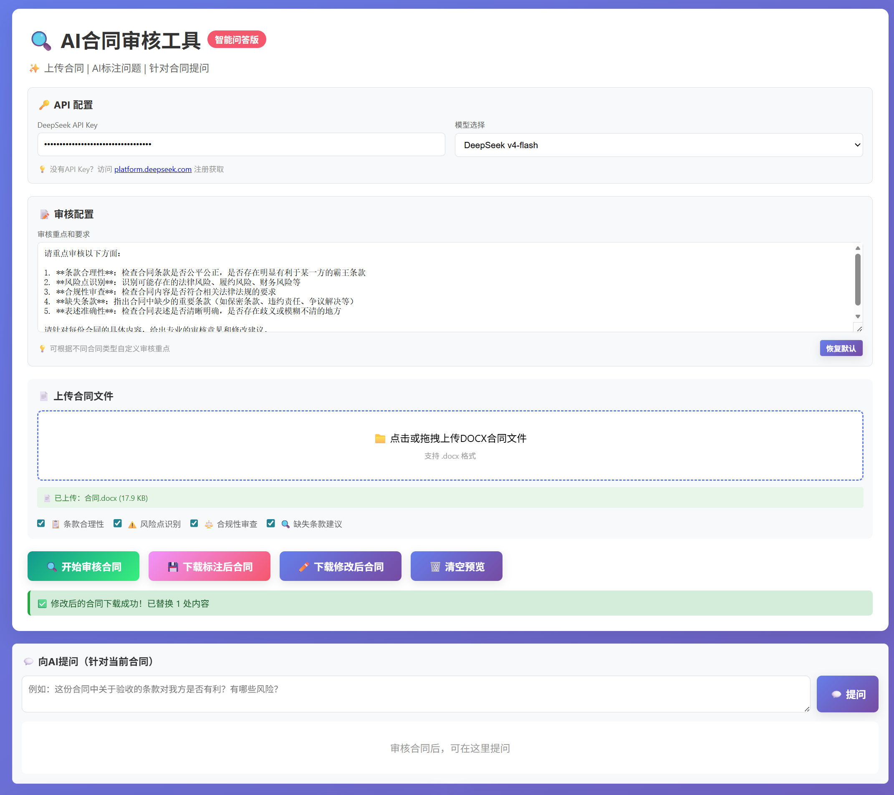
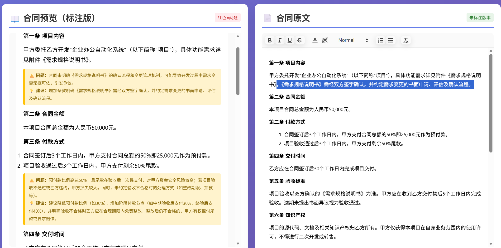
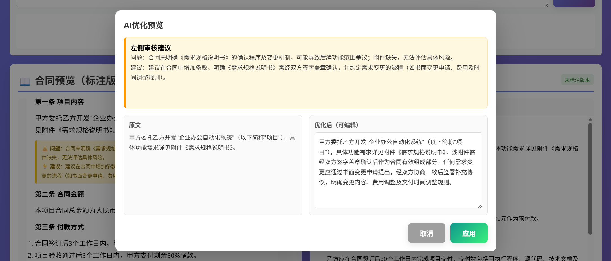
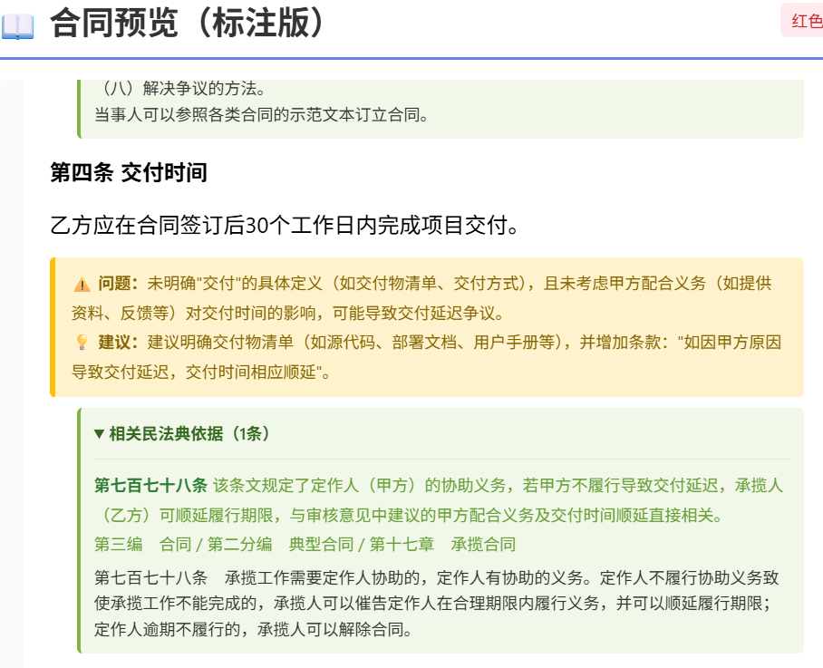
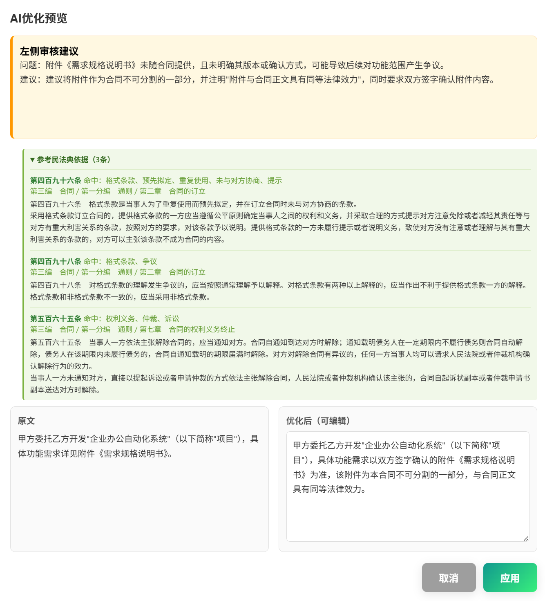
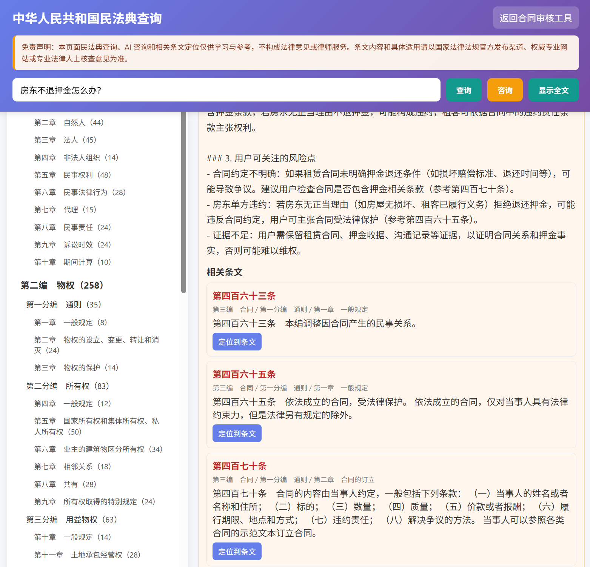
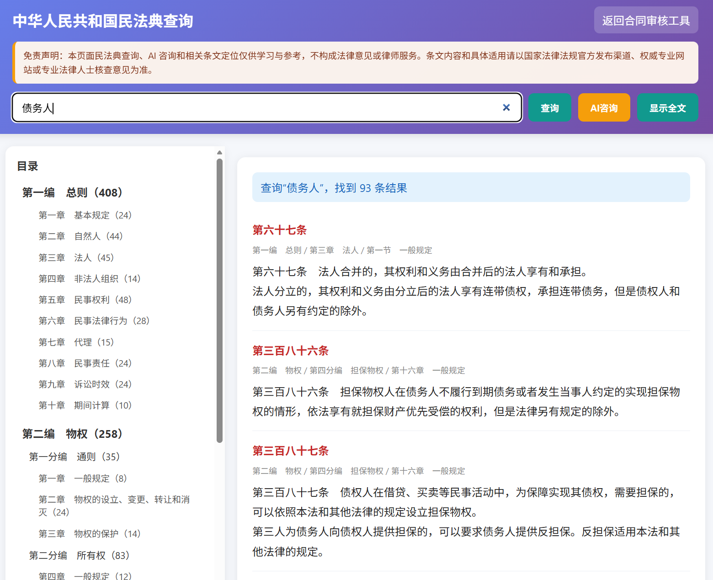

<div align="center">

# 📜 AI合同审核工具 | Contract Review Assistant

**上传 DOCX · AI智能审核 · 民法典依据 · 民法典查询 · 保留格式导出 · 自由问答 · 原文在线编辑 · 历史记录**

[](https://github.com/hexiongjiu/contract-reviewer/actions/workflows/pages.yml)
[](LICENSE)
[](https://hexiongjiu.github.io/contract-reviewer/)

</div>

---

## 📸 界面预览

| 工具首页 | 原文对照 |
|:---:|:---:|
|  |  |

| 向AI提问 | 直接在网页修改 |
|:---:|:---:|
|  |  |

| AI优化后替换原文 | 合同标注相关民法典依据 |
|:---:|:---:|
|  |  |

| AI优化参考民法典 | AI结合条文解答问题 |
|:---:|:---:|
|  |  |

| 关键词搜索相关条文 |
|:---:|
|  |

---

## 🇨🇳 中文说明

### 这是什么？

纯前端 AI 合同审核工具。上传 DOCX 合同 → DeepSeek AI 自动审核 → 红色加粗标注问题条款 → 黄色高亮显示问题建议 → 自动核对并展示相关民法典依据 → 下载保留原始格式的标注合同。

右侧原文面板支持**富文本在线编辑**和**AI 段落优化**，可结合审核建议和本地民法典候选条文生成优化版本，修改后可下载保留原始格式的修改版 DOCX。

项目内置《中华人民共和国民法典》查询页面，支持全文浏览、关键词/条号搜索、AI 咨询并快速定位相关条文。API Key 仅存储在浏览器 `localStorage`，直连 DeepSeek。

### ✨ 核心功能

- 📜 **历史记录管理** — 审核结果自动保存到本地，支持加载、查看和删除历史记录
- 📄 **DOCX 上传与解析** — 基于 Mammoth.js，支持表格、列表、加粗等格式
- 🤖 **DeepSeek AI 智能审核** — 条款合理性 / 风险识别 / 合规审查 / 缺失条款
- 🔴 **问题条款红色加粗** — AI 自动标注问题原文，一目了然
- 🟡 **黄色标注建议** — 每个问题附带详细的修改建议
- ⚖️ **民法典依据核对** — 本地召回候选条文，再由 AI 逐条核对相关性并展示依据
- 📖 **民法典查询页** — 支持完整浏览、关键词/条号搜索、AI 咨询和一键定位条文
- ✏️ **原文在线编辑** — 右侧面板集成 Quill 富文本编辑器，可随时修改合同内容
- ✨ **AI 优化原文** — 悬停原文段落即可结合审核建议和参考法条生成优化版本
- 💾 **下载标注合同** — **100% 保留原始格式**，标注插入到对应条款后
- 💾 **下载修改后合同** — 编辑后的内容写入原 DOCX，保留字体、大小、加粗等格式
- 💬 **合同自由问答** — 针对当前合同内容向 AI 提问，并可附带相关民法典依据
- 🔑 **隐私优先** — API Key 仅存储在浏览器 `localStorage`，直连 DeepSeek

---

## 🇺🇸 English

A 100% front-end AI contract review tool. Upload DOCX → DeepSeek review → red bold problem highlights → yellow annotation suggestions → Civil Code references → download annotated DOCX with original formatting preserved. It also includes a Civil Code browser/search page with AI consultation and article jump links.

---

## 🆕 新增功能

### 2026-06-20

- **历史记录管理** — 每次审核自动保存到浏览器本地存储，支持加载、查看和删除历史审核记录

### 2026-06-15

- **民法典依据展示** — 合同审核意见下方逐条显示 AI 核对后的相关民法典依据
- **民法典查询页** — 新增 `civil-code.html`，支持完整浏览、关键词/条号搜索、AI 咨询和快速定位条文
- **AI 优化参考法条** — 段落优化预览中展示本次参考的民法典依据
- **合同问答引用依据** — 针对当前合同提问时可结合相关民法典条文辅助回答

### 2026-06-13

- **AI 优化原文** — 右侧原文段落悬停显示 AI 优化按钮，结合左侧审核建议生成可编辑优化版本，确认后替换原文

### 2026-05-28

- **原文在线编辑** — 右侧合同原文面板集成 Quill 富文本编辑器，支持加粗、颜色、标题、列表等格式，可直接在网页上修改合同内容
- **下载修改后合同** — 编辑完成后可下载修改版 DOCX，保留原始字体、大小、加粗等格式

### 2026-05-22

- 初始版本发布：DOCX 上传解析、DeepSeek AI 审核、问题标注、合同问答、标注合同下载

---

## ⚠️ 免责声明

本工具及民法典相关引用仅供学习、参考和辅助审阅，不构成法律意见或律师服务。AI 生成内容可能存在遗漏或偏差，民法典条款及法律适用请以国家法律法规官方发布渠道、权威专业网站或专业法律人士核查意见为准。

---

## 🚀 快速开始

### 🌐 在线使用

直接访问：**[https://hexiongjiu.github.io/contract-reviewer/](https://hexiongjiu.github.io/contract-reviewer/)**

> 本项目已配置 GitHub Actions 自动部署到 GitHub Pages，每次推送代码自动更新。

### 💻 本地运行

```bash
git clone https://github.com/hexiongjiu/contract-reviewer.git
cd contract-reviewer
# 用浏览器打开 index.html，或用本地服务器：
python -m http.server 8080
# 访问 http://localhost:8080
# 民法典查询页：http://localhost:8080/civil-code.html
```

### 🔑 获取 API Key

访问 [platform.deepseek.com](https://platform.deepseek.com/) 注册并获取 API Key，粘贴到工具页面即可使用。

---

## 🙏 致谢

本项目基于以下优秀的开源库构建：

| 库 | 用途 | 许可证 |
|---|---|---|
| [Mammoth.js](https://github.com/mwilliamson/mammoth.js) | DOCX 解析 | BSD-2 |
| [JSZip](https://github.com/Stuk/jszip) | DOCX 格式保留与修改 | MIT |
| [Quill.js](https://github.com/quilljs/quill) | 富文本编辑器 | BSD-3 |
| 《中华人民共和国民法典》 | 法条查询与参考依据 | 法律法规文本，请以官方发布为准 |

详见 [THIRD_PARTY_LICENSES.md](THIRD_PARTY_LICENSES.md)

---

## 📝 License

MIT © 2026 hexiongjiu
